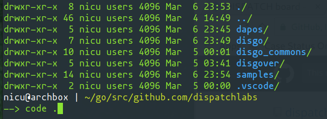
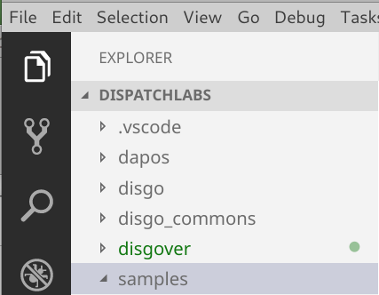

# VS Code
##### How I do it
- Clone all repos from `https://github.com/dispatchlabs` in one folder the run `code dispatchlabs`
- Copy the `launch.json` above into the `.vscode` folder
- This is how it looks like

