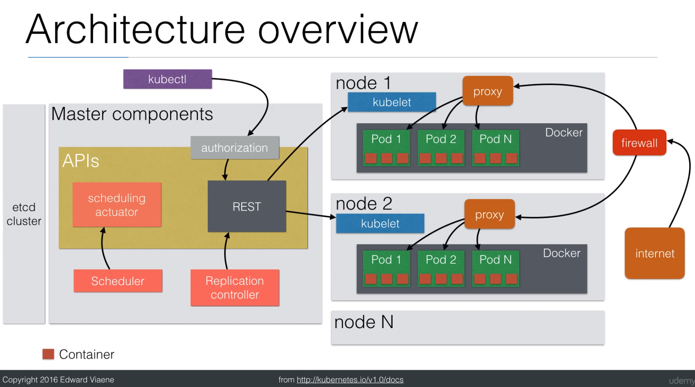

# Concepts
Kubernetes - open source Docker orchestration.
	- handles scheduling onto nodes in a compute cluster and actively manages workloads to ensure taht their state matches the users declared intentions
	- using concepts `label` and `pod` it groups the containers which makeup an application into logical units for easy management and discovery

#  Docker Install
- Mac (https://docs.docker.com/docker-for-mac)
	- `curl -O https://download.docker.com/mac/stable/Docker.dmg`
	- Open and install the DMG file, it has all the requirements (Engine and Compose)

- Arch (https://wiki.archlinux.org/index.php/Docker)
	- `sudo pacman -S docker docker-compose`
	- `sudo systemctl enable docker`
	- `sudo systemctl start docker`
	- `sudo gpasswd -a USER docker`

- Ubuntu (https://docs.docker.com/engine/installation/linux/docker-ce/ubuntu) (aka AWS)
	- `sudo apt-get update`
	- `sudo apt-get install apt-transport-https ca-certificates curl software-properties-common`
	- `curl -fsSL https://download.docker.com/linux/ubuntu/gpg | sudo apt-key add -`
	- `sudo add-apt-repository "deb [arch=amd64] https://download.docker.com/linux/ubuntu $(lsb_release -cs) stable"`
	- `sudo apt-get update`
	- `sudo apt-get install docker-ce`
		- `apt-cache madison docker-ce` (in PROD)
		- `sudo apt-get install docker-ce=<VERSION>` (in PROD)

##### Dox
- `docker container ls` -> list conatiners
	- `docker container stop CONTAINER_ID`
	- `docker container rm CONTAINER_ID` -> delete container, must be stopped first
- `docker images` -> list images
	- `docker rmi IMAGEID` -> delete image, add `-f` to force

#  Kubernetes Install

##### kubectl
- Mac (https://docs.docker.com/docker-for-mac)
	- `curl -LO https://storage.googleapis.com/kubernetes-release/release/`curl -s https://storage.googleapis.com/kubernetes-release/release/stable.txt`/bin/darwin/amd64/kubectl`
	- `chmod +x ./kubectl`
	- `sudo mv ./kubectl /usr/local/bin/kubectl`

- Linux
	- `curl -LO https://storage.googleapis.com/kubernetes-release/release/$(curl -s https://storage.googleapis.com/kubernetes-release/release/stable.txt)/bin/linux/amd64/kubectl`
	- `chmod +x ./kubectl`
	- `sudo mv ./kubectl /usr/local/bin/kubectl`

##### minikube
- Mac: `brew cask install minikube`
- Linux
	- `curl -Lo minikube https://storage.googleapis.com/minikube/releases/latest/minikube-linux-amd64`
	- `chmod +x minikube && sudo mv minikube /usr/local/bin/`

##### VirtualBox
- Download and install on your machine

##### Dox
- `kubectl get deployments`
	- `kubectl delete deployment ...`
- `kubectl get pods`
	- `kubectl delete pod ...`
- `minikube dashboard`

#  Run Local Cluster
- Arch Linux
	- `minikube start`
	- `eval $(minikube docker-env)`
	- `docker run --detach --publish 5000:5000 --name LocalPrivateRegistry registry:2`
	- `docker build -t disgo:v1 .` _-> will say `Successfully built XXXXXXXXXXX` the XXX part is `JUST_CREATED_IMAGE_ID` used below_
-	- `docker tag JUST_CREATED_IMAGE_ID localhost:5000/disgo:v1`
	- `docker push localhost:5000/disgo:v1`
	- `kubectl run disgo-private-cluster --image=localhost:5000/disgo:v1 --image-pull-policy=Never`
	-  OR
	- `kubectl create -f disgo-private-cluster.yaml`
